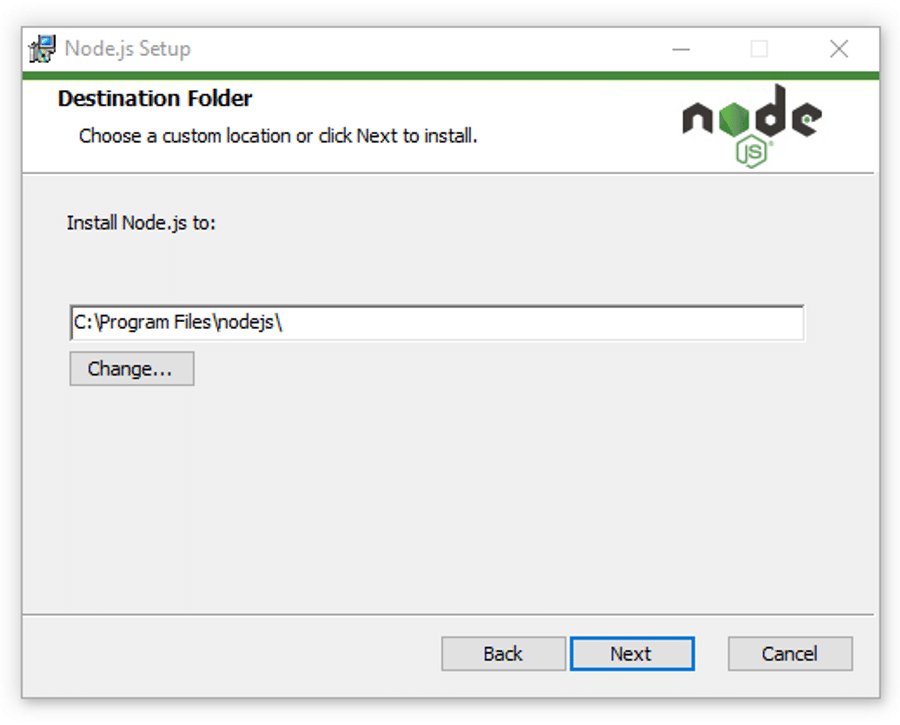
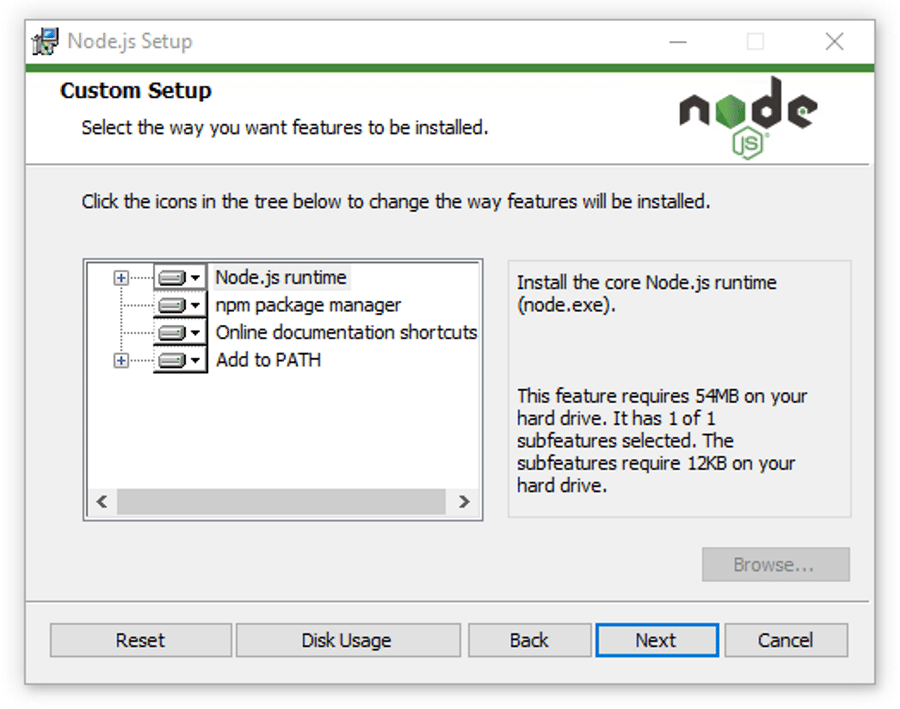
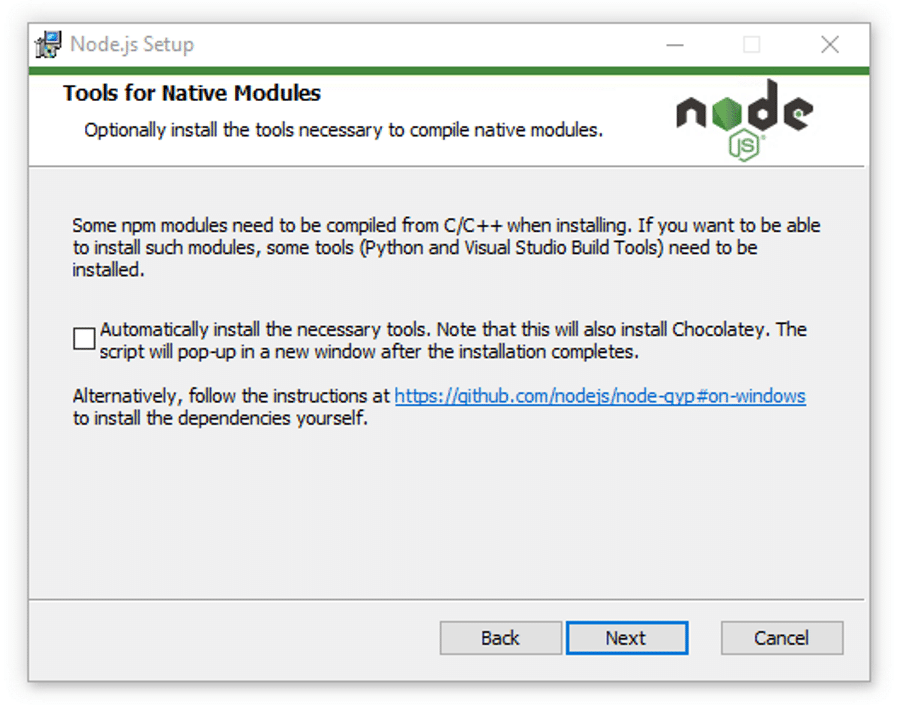
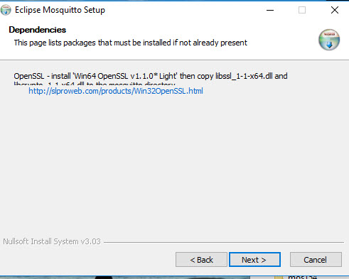
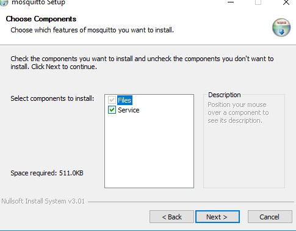
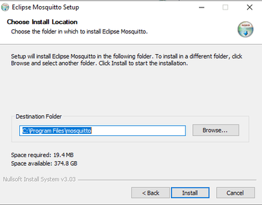
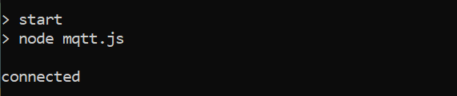

# T8 Project

>status: the development of the project has stopped for now and there are no plans to continue it in the future

## Dentistimo Middleware

This is the middleware of group eights [Dentistimo](https://git.chalmers.se/courses/dit355/dit356-2022/t-8/documentation) system. Dentistimo is a distributed system which allows users to book dentist apointments in the Gothenburg region and allows for more clinics to be added in the future. This repository contains the middleware which is responible for allowing other components of the system to communicate with one another. This is done through the use of [MQTT](https://mqtt.org/) and [WebSocket](https://developer.mozilla.org/en-US/docs/Web/API/WebSockets_API). Messages are sent in the [JSON](https://www.json.org/json-en.html) fromat (id, request, url, data, authenticated). The middleware component provides the following functionalities:

- recieve mqtt messages through a wbesocket connection
- parse mqtt messages
- send mqtt messages through a websocket connection
- create new mqtt topics
- subscribe and publish to mqtt topics
- distinguish between authenticated and unauthenticated requests

## Installation
In order to run the component you need to have the project on your computer, node.js installed and mosquito instaled. 
- The first stepp is installing [node.js](https://nodejs.org/en/download/), what version you should download depends on your operating system (this guid will show the process for windows, if you're using mac or linux you can check out [this](https://kinsta.com/blog/how-to-install-node-js/) guid which explains that process aswell)
  - Double click the .msi file in order to begin the installation process

&nbsp;
&nbsp;


*Click on next.*

&nbsp;



*select the destination where you want to install Node.js. If you don’t want to change the directory, go with the Windows default location and click the Next button again.*

&nbsp;



*If you want a standard installation with the Node.js default features, click the Next button. Otherwise, you can select your specific elements from the icons in the tree before clicking Next.*

&nbsp;



*Node.js offers you options to install tools for native modules. If you’re interested in these, click the checkbox to mark your preferences, or click Next to move forward with the default.*

&nbsp;


*Click install, this can take a couple of minutes*

&nbsp;

  - Once you have finished the installation you can verify it by opening the [CMD](https://www.lifewire.com/command-prompt-2625840) and typeing:

  >```node --version```

  - You can allso check npm by typing:

  >```npm --version```

  If node has been correctly installed you should see the version name in the CMD prompt

&nbsp;

- The second step is to install the [mosquitto broker](https://mosquitto.org/download/), once again this will be different depending on your OS. This guide will show the process for windows but you can check out the [Mac](https://subscription.packtpub.com/book/application-development/9781787287815/1/ch01lvl1sec12/installing-a-mosquitto-broker-on-macos) or [Linux](https://www.vultr.com/docs/install-mosquitto-mqtt-broker-on-ubuntu-20-04-server/) guides if you are using a different operating system.
  - Double cick the install script

&nbsp;
&nbsp;



*Note the dependencies screen which tells you what additional files are required. The screen is note very clear.*

&nbsp;



*Select components check service to install as a service if you want mosquitto to start automatically when windows starts.*

&nbsp;



*Choose a location and click install, it defaults to c:\program files\mosquitto.*

&nbsp;

  - Once you have finished installing you can start the mosquitto broker by going to the location where you installed mqtt, opening the [CMD](https://www.lifewire.com/command-prompt-2625840) and typeing:
  
  > ```mosquitto```

- The next step is to download the project .zip file or pull the project with [git](https://git-scm.com/), if you have that installed.

- Extract the project files from the .zip and put them in a place you can easily find, example: 
  >C:\Users\name\Desktop\t8-project-main

- open the [CMD](https://www.lifewire.com/command-prompt-2625840) and go to the directory where you put the files. this can be done by typing cd + the file path. If I put my files in C:\Users\name\Desktop\t8-project-main I would type:
  >cd C:\Users\name\Desktop\t8-project-main

- The last step is to run the command
  >npm start

If everything is installed correctly and running as it should you should see something like this

 

Within a particular ecosystem, there may be a common way of installing things, such as using Yarn, NuGet, or Homebrew. However, consider the possibility that whoever is reading your README is a novice and would like more guidance. Listing specific steps helps remove ambiguity and gets people to using your project as quickly as possible. If it only runs in a specific context like a particular programming language version or operating system or has dependencies that have to be installed manually, also add a Requirements subsection.

## Usage
The middleware can only really be used for one purpouse and that is lightweight communication through mqtt. By creating something simmilar to the [component](https://git.chalmers.se/courses/dit355/dit356-2022/t-8/client-server/-/blob/booking_logic/client/src/MQTT.js) on our client side which sends mqtt request in the required format and a [component](https://git.chalmers.se/courses/dit355/dit356-2022/t-8/data-manager/-/blob/main/Interpreter.js) which can recieve messages, you can easily send messages between those using the middleware. The format of the messages can also be changed to suit the needs of the system and messages can allways be checked when passing through the midleware if need be. This does however require changing the source code.

## Support
If you encounter any issue related to the middleware we recomend first checking that both node.js and mqtt is working corectly as they are the most likely point of failure. running the tests can also be usefull for identifying issues in the system. If neiher of those work you are free to contact us at [this](mailto:djcoetzer10@gmail.com) email. 

## Contributing
We are for the moment not open to contributions.

## Authors and acknowledgment
@coetzer

@ayvazian

@yasaminf

@dunvald

@aminmah

@samcenko

@shatskyi

## License
[](https://opensource.org/licenses/MIT)

## Project status
If you have run out of energy or time for your project, put a note at the top of the README saying that development has slowed down or stopped completely. Someone may choose to fork your project or volunteer to step in as a maintainer or owner, allowing your project to keep going. You can also make an explicit request for maintainers.
